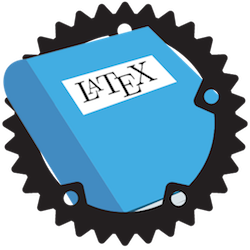

**This project is still alpha!**

# Papers



A Latex template to PDF generation web service written in Rust. Papers is available as a docker image on [Docker Hub](https://hub.docker.com/r/store2be/pape-rs/).


## Examples / Documentation

* [Simple example](examples/simple)
* [Papers on Kubernetes](examples/kubernetes)
* [Merge documents with Papers](examples/concatenation)


## Security

**This service is not secure yet so it should not be publicly accessible.** An invader could create a template [that does bad things with Latex](http://www.lieberbiber.de/2017/03/05/arbitrary-code-execution-in-many-tex-distributions/). There is no method in place yet to prevent bad behavior.


## Endpoints

### GET /healthz

Returns 200. [For liveness probes in Kubernetes](https://kubernetes.io/docs/tasks/configure-pod-container/configure-liveness-readiness-probes/).


### POST /submit

Headers:

```
Content-Type: application/json
```

Exmpale body:

```json
{
  "template_url": "http://example.com/template.tex",
  "asset_urls": [
    "http://example.com/logo.png"
  ],
  "variables": {
    "world": "World"
  },
  "callback_url": "http://example.com/callback"
}
```

* `template_url`: The Latex template as a downloadable URL.
* `asset_urls`: An array of asset URLs that are used in the Latex template. They are downloaded next to the Latex document.
* `variables`: The variables that are used in the Latex template.
* `callback_url`: The URL that the final PDF or the error will be sent to.


### POST /preview

Headers:

```
Content-Type: application/json
```

Example body:

```json
{
  "template_url": "http://example.com/template.tex",
  "asset_urls": [
    "http://example.com/logo.png"
  ],
  "variables": {
    "world": "World"
  },
}
```

* `template_url`: The Latex template as a downloadable URL.
* `asset_urls`: An array of asset URLs that are used in the Latex template. They are downloaded next to the Latex document.
* `variables`: The variables that are used in the Latex template.


## Example Latex template

The templating language is [Tera](https://github.com/Keats/tera)

```latex
\documentclass{article}

\begin{document}
hello, {{world}}

\end{document}
```

## Local server

Papers ships with the `papers-local` executable that you can use to develop your templates locally. Just put your assets in a directory, name your template `template.tex`, put variables in a `variables.json` and run the binary. You will get a rendered PDF that is produced by the same code that runs in the service.

Take a look at the [simple example](examples/simple) in the examples directory for a quick introduction.

## Explanation of the environment variables

### PAPERS_LOG_LEVEL

The logger level for the papers service.

```
Default: info
Other options: debug
```
